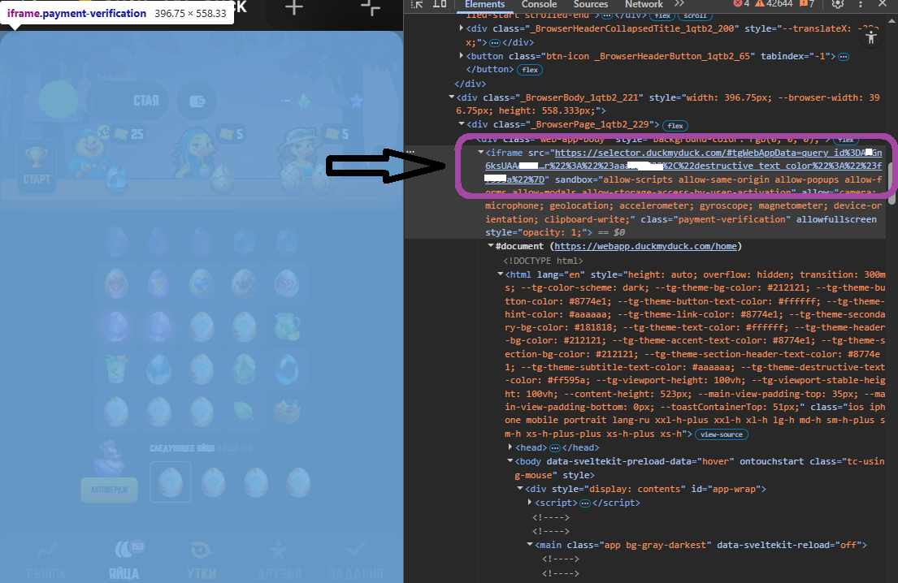

# DuckBot

DuckBot — CLI-проект для автоматизации DuckMyDuck с многопрофильной авторизацией, конфигом, логированием и разнесенной бизнес-логикой.

Проект работает только через реальный `webapp_url` или `init_data` из Telegram WebApp. Бот не генерирует ссылку сам и не получает `init_data` через Telegram-клиент.

## Что умеет проект

- Работает с несколькими профилями последовательно и изолированно.
- Сам меняет `Telegram init_data` на игровой JWT через `POST /auth/telegram`.
- Всегда ходит в API как Android WebView с фиксированным mobile fingerprint.
- Кормит уток по настраиваемым правилам редкости, уровня и стоимости шага.
- Отправляет уток на скрещивание по настраиваемым правилам редкости и уровня.
- Обрабатывает яйца, если это включено в конфиге.
- Собирает подтверждаемые награды из алертов.
- Собирает обычные награды задач через `/tasks/reward`.
- Умеет участвовать в турнире по сдаче яиц через `/tasks/reward/custom` и может быть полностью выключен отдельным флагом.
- Анализирует активные турниры и механику Clan Show.
- Пишет логи в консоль и файл, маскируя секреты.

## Архитектура

```text
duckbot/
  __init__.py
  __main__.py
  config.py
  constants.py
  exceptions.py
  masking.py
  app/
    runner.py
  cli/
    app.py
  game/
    __init__.py
    automation.py
    alerts_service.py
    base.py
    clan_show_service.py
    duck_service.py
    egg_service.py
    models.py
    player_service.py
    task_service.py
    tournament_service.py
  http/
    api_client.py
    auth_manager.py
    header_builder.py
  storage/
    runtime_state.py
  support/
    logging_setup.py
config.example.yaml
profiles.local.example.yaml
run.cmd
run.ps1
requirements.txt
README.md
```

Зоны ответственности внутри `duckbot/game`:

- `player_service.py` — снимок игрока и первичные данные профиля.
- `duck_service.py` — выбор активных уток, кормление и скрещивание.
- `egg_service.py` — merge/open логика яиц.
- `alerts_service.py` — подтверждение наград из алертов.
- `task_service.py` — обычные и кастомные награды задач.
- `tournament_service.py` — анализ турниров.
- `clan_show_service.py` — аналитика Clan Show.
- `automation.py` — orchestration цикла без бизнес-логики по конкретным механикам.

## Быстрый старт

1. Создайте виртуальное окружение:

```powershell
python -m venv .venv
.venv\Scripts\Activate.ps1
```

2. Установите зависимости:

```powershell
pip install -r requirements.txt
```

3. Создайте рабочие конфиги:

```powershell
Copy-Item config.example.yaml config.yaml
Copy-Item profiles.local.example.yaml profiles.local.yaml
```

4. Заполните `profiles.local.yaml`.

5. Проверьте авторизацию:

```powershell
python -m duckbot auth-check --profile main
```

6. Запустите один цикл:

```powershell
python -m duckbot once --profile main
```

7. Для бесконечного запуска по всем включенным профилям используйте любой из вариантов:

```powershell
python -m duckbot run --all
```

```powershell
.\run.ps1
```

```cmd
run.cmd
```

`run.ps1` и `run.cmd` ищут Python в `.venv\Scripts\python.exe`, затем в `venv\Scripts\python.exe`, и только потом используют `python` из `PATH`. Если аргументы не переданы, по умолчанию запускается `run --all`.
Если вы запускаете `run.cmd` из PowerShell, используйте `.\run.cmd`.

## Настройка `config.yaml`

`config.yaml` хранит только общие настройки без секретов.

Ключевые поля:

- `api_base_url` — базовый API, по умолчанию `https://api.duckmyduck.com`.
- `request_timeout_seconds` — таймаут одного запроса.
- `cycle_sleep_seconds` — пауза между глобальными циклами в режиме `run`.
- `between_profiles_delay_seconds` — пауза между профилями.
- `between_actions_delay_seconds` — пауза между игровыми действиями.
- `after_feed_delay_seconds` — пауза после кормления и открытия яиц.
- `logging` — уровень логов, файл и ротация.
- `retry` — повторы, базовая задержка и множитель ожидания для `429`.
- `auth.state_path` — путь к runtime-кэшу JWT.

Флаги `features`:

- `process_eggs` — включить обработку яиц.
- `participate_egg_tournaments` — участвовать в турнире по сдаче яиц. Если флаг выключен, бот не сдает яйца в турнирные задачи, не открывает яйца с кулдауном и сразу чистит инвентарь от обычных `REGULAR_TOURNAMENT_EGG`.
- `collect_alert_rewards` — подтверждать награды из алертов.
- `collect_task_rewards` — собирать обычные награды задач.
- `collect_custom_task_rewards` — собирать кастомные турнирные награды. Имеет смысл вместе с `participate_egg_tournaments`.
- `inspect_tournaments` — анализировать активные турниры.
- `inspect_clan_show` — анализировать Clan Show.

Параметры `game`:

- `max_merge_slot` — размер активного поля яиц.
- `egg_merge_limits` — до какого уровня можно объединять яйца каждого типа. Когда пара уже уперлась в лимит, бот ее пропускает и продолжает искать остальные валидные merge ниже.
- `clan_show_log_best_targets_limit` — сколько лучших целей Clan Show показывать в логах.
- `clan_show_log_recent_attacks_limit` — сколько недавних атак показывать в логах аналитики.
- `feed_rules` — компактные лимиты кормления по редкости и уровням.
- `breed_rules` — компактные правила скрещивания по редкости и уровням.

Секция `http_headers` хранит безопасные общие заголовки. Mobile fingerprint не переопределяется и всегда остается Android WebView.

### Компактные правила кормления

`feed_rules` задаются по редкости. Список из пяти элементов соответствует уровням `1..5`.

Пример:

```yaml
game:
  feed_rules:
    COMMON: [30, 30, 35, 40, null]
    UNCOMMON: [80, 80, 80, 90, 100]
    RARE: [120, 120, null, null, null]
```

Что это значит:

- `COMMON` можно кормить до стоимости `30`, `30`, `35`, `40` на уровнях `1..4`.
- `COMMON` уровня `5` пропускается, потому что для него задан `null`.
- `RARE` будет кормиться только на уровнях `1` и `2`.

Старый формат `feed_limits` поддерживается только как fallback для совместимости, но для новых конфигов рекомендуется использовать именно `feed_rules`.

### Компактные правила скрещивания

`breed_rules` задаются по редкости. Для каждой редкости указываются разрешенные уровни и валюта.

Пример:

```yaml
game:
  breed_rules:
    COMMON:
      currency: "corn"
      levels: [1, 2, 3, 4]
    UNCOMMON:
      currency: "corn"
      levels: [2, 3]
```

Что это значит:

- `COMMON` будет отправляться на скрещивание только на уровнях `1..4`.
- Уровень `5` в скрещивание не идет.
- В `STAKE` бот никого не отправляет автоматически.

## Настройка `profiles.local.yaml`

Этот файл содержит секреты и не должен попадать в git.

Для каждого профиля обязательны:

- `name`
- `enabled`
- ровно один источник авторизации: `webapp_url` или `init_data`

Пример:

```yaml
profiles:
  - name: "main"
    enabled: true
    api_base_url: "https://api.duckmyduck.com"
    webapp_url: "https://selector.duckmyduck.com/#tgWebAppData=..."

  - name: "alt"
    enabled: false
    init_data: "query_id=...&user=%7B...%7D&auth_date=...&signature=...&hash=..."
```

Важно:

- нельзя указывать одновременно `webapp_url` и `init_data`
- нельзя оставлять оба поля пустыми
- `init_data` можно хранить как raw-строку или percent-encoded вариант
- `api_base_url` у профиля можно переопределить отдельно, например для `api-ru`

### Как получить `webapp_url`

Если вы используете профиль через `webapp_url`, нужен полный `src` у iframe, в котором открыт DuckMyDuck. Важно копировать именно всю ссылку целиком, вместе с `tgWebAppData`.

Порядок действий:

1. Откройте страницу с игрой.
2. Нажмите `F12`, чтобы открыть DevTools.
3. Перейдите в `Elements` или `Console`.
4. Найдите iframe игры. В нашем случае это `iframe.payment-verification`.
5. Скопируйте значение `src` и вставьте его в `profiles.local.yaml` как `webapp_url`.

Быстрый способ через консоль:

```js
document.querySelector("iframe.payment-verification")?.src
```

Если класс отличается, можно попробовать более общий вариант:

```js
document.querySelector("iframe")?.src
```

Нужно получить ссылку вида:

```text
https://webapp.duckmyduck.com/home?tgWebAppData=...
```

Именно ее затем использует бот, чтобы извлечь `tgWebAppData` и обменять его на JWT через `/auth/telegram`.



## Команды

Проверка авторизации:

```powershell
python -m duckbot auth-check --profile main
```

Один цикл по одному профилю:

```powershell
python -m duckbot once --profile main
```

Один цикл по всем включенным профилям:

```powershell
python -m duckbot once --all
```

Бесконечный рабочий цикл по одному профилю:

```powershell
python -m duckbot run --profile main
```

Бесконечный рабочий цикл по всем включенным профилям:

```powershell
python -m duckbot run --all
```

Альтернатива для Windows:

```powershell
.\run.ps1
```

```cmd
.\run.cmd
```

Если нужно использовать нестандартные пути:

```powershell
python -m duckbot --config custom-config.yaml --profiles-file custom-profiles.yaml once --all
```

## Как устроена авторизация

Поток авторизации такой:

1. Профиль хранит `webapp_url` или `init_data`.
2. Если задан `webapp_url`, из него извлекается `tgWebAppData`.
3. Бот вызывает `POST /auth/telegram`.
4. Сервер игры возвращает JWT.
5. JWT сохраняется в `runtime/state.json`.
6. При старте, при `401` и перед истечением `exp` токен обновляется автоматически.

## Что реализовано по новой механике

По `endpoints.txt` и ответам API вынесены отдельные сценарии:

- `/alert/action` — подтверждение наград из алертов.
- `/tasks` и `/tasks/reward` — сбор обычных наград задач.
- `/tasks/reward/custom` — обработка кастомных турнирных задач.
- `/tournaments` — анализ активных турниров.
- `/clans/show/sabotages` — чтение доступных саботажей.
- `/clans/show/sabotage/best-targets` — выбор лучших целей по шансам и риску.
- `/clans/show/sabotage/attacks` — чтение истории атак.

Что важно:

- `collect_custom_task_rewards` по умолчанию выключен, потому что такие задачи расходуют яйца.
- Если `participate_egg_tournaments=true`, бот перед каждым merge сначала проверяет, можно ли сразу сдать яйца с активного поля в турнирную задачу.
- После успешной турнирной сдачи бот перечитывает `/tasks`, чтобы открыть следующую ступень цепочки и не работать по устаревшему состоянию.
- Если `participate_egg_tournaments=false`, бот не сдает яйца в турнирные задачи, не открывает яйца с кулдауном и сразу чистит инвентарь от обычных `REGULAR_TOURNAMENT_EGG`.
- Для обычного подбора `slotIds` вне режима обработки яиц бот по-прежнему предпочитает инвентарные слоты вне активного merge-поля.
- Использование `/clans/show/sabotage/use` автоматически не включено: там нужен осознанный выбор цели, и это уже боевая мутация, а не безопасный сбор наград.

## Что исправлено

- Исправлена ошибка со стейкингом: раньше бот резал список уток по `duckSlotsCount` до фильтрации состояний, поэтому `STAKE` съедал один слот и часть кормимых уток пропускалась.
- Теперь активные утки выбираются только из состояний `FEED`, `BREED` и `BREEDING`, и только потом ограничиваются количеством слотов.
- Игровая логика больше не живет в одном монолите: она разнесена по сервисам с четкой зоной ответственности.
- После кастомных турнирных наград список яиц больше не переиспользуется вслепую в том же цикле, чтобы не работать по устаревшему снимку.
- Турнирные яйца больше не пытаются объединяться выше разрешенного уровня: для `REGULAR_TOURNAMENT_EGG` потолок — 5 уровень, дальше яйцо либо сдается в задачу, либо остается как готовое под турнирную цепочку.

## Логи и runtime-состояние

- Логи по умолчанию пишутся в `logs/duckbot.log`.
- JWT и служебное состояние профилей хранятся в `runtime/state.json`.
- В логах маскируются `authorization`, JWT, `init_data`, полный `webapp_url` и чувствительные query-параметры Telegram.

Пример записи о кормлении:

```text
Покормили утку 27322585 редкости UNCOMMON (2/190), стоимость шага=2 corn, остаток=123456 corn
```

## Mobile fingerprint

Все запросы всегда отправляются как Android WebView.

Ключевые заголовки:

- `sec-ch-ua-platform: "Android"`
- `sec-ch-ua-mobile: ?1`
- `user-agent: Mozilla/5.0 (Linux; Android 12; Pixel 6 Build/SQ3A.220705.004; wv) AppleWebKit/537.36 (KHTML, like Gecko) Version/4.0 Chrome/143.0.0.0 Mobile Safari/537.36`

## Запуск в Windows

Сам бот работает как обычный долгоживущий процесс. Для автозапуска можно использовать:

- `Task Scheduler`
- `NSSM`
- любой другой менеджер процессов

Команда запуска:

```powershell
python -m duckbot run --all
```

Или корневой launcher:

```cmd
.\run.cmd
```

Рабочая директория должна указывать на корень проекта, где лежат `config.yaml` и `profiles.local.yaml`.

## Проверка проекта

Запуск тестов:

```powershell
python -m unittest discover -s tests -v
```

Рекомендуемый smoke flow:

1. `python -m duckbot auth-check --profile main`
2. `python -m duckbot once --profile main`
3. `python -m duckbot run --all`

## Устранение неполадок

`INIT_WRONG`

- `init_data` устарел
- в профиль попала неполная ссылка
- скопирован не `tgWebAppData`, а другая часть URL

`401 Unauthorized`

- сервер отозвал старый JWT
- бот сам попытается получить новый через `/auth/telegram`

`Файл config.yaml не найден`

- создайте `config.yaml` из `config.example.yaml`

`Профиль не найден`

- проверьте имя профиля в `profiles.local.yaml`
- проверьте корректность YAML
